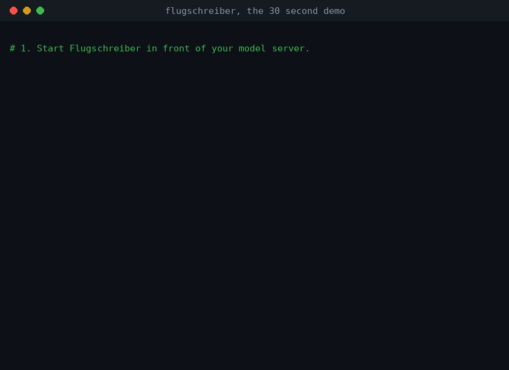

# Flugschreiber

**Tamper-evident audit logs and EU AI Act documentation for self-hosted LLMs. One base URL change, no application code.**

[](https://github.com/RamazanKara/flugschreiber/actions/workflows/ci.yml)
[](https://pkg.go.dev/github.com/RamazanKara/flugschreiber)
[](LICENSE)

Somebody asked you what evidence you have of what your AI did last quarter. You
run vLLM behind an internal API. You have Grafana dashboards and 30 days of
application logs that were never designed to answer that question, and the
teams whose code calls the model are not going to add an SDK because compliance
asked nicely.

Flugschreiber is a reverse proxy you put in front of any OpenAI-compatible
endpoint. It records every model interaction to an append-only, hash-chained
log, and it generates the technical documentation and transparency artifacts
that AI Act preparation needs as inputs, pre-filled from traffic it actually
observed.



<sub>The same recording as an [mp4](docs/media/demo.mp4). Rendered from
[scripts/demo.sh](scripts/demo.sh) against the built-in mock upstream, so what
it shows is exactly what the quickstart below does.</sub>

## Sixty seconds

```bash
docker run -d --name flugschreiber \
  -p 8080:8080 -v fs-evidence:/var/lib/flugschreiber \
  ghcr.io/ramazankara/flugschreiber:latest serve --mock-upstream
```

Point an app at it and make a few calls:

```bash
export OPENAI_BASE_URL=http://localhost:8080/v1
export OPENAI_API_KEY=anything

curl $OPENAI_BASE_URL/chat/completions -H 'Content-Type: application/json' \
  -d '{"model":"llama-3.1-8b","messages":[{"role":"user","content":"hello"}]}'
```

Then ask what it recorded:

```bash
docker exec flugschreiber flugschreiber verify --dir /var/lib/flugschreiber
```

```
hash chain intact

  directory   /var/lib/flugschreiber
  segments    1
  records     3
  sequence    1 to 3
  head hash   dbbbf2ff9f5ab06a06de9002235539b3d0735b443b0f5a2c4f8964315ab3a5ae
  checked in  175.208µs
```

And generate the documents:

```bash
docker exec flugschreiber flugschreiber report \
  --dir /var/lib/flugschreiber --out /tmp/reports \
  --organisation "Muster GmbH" --system-name "Support Assistant"
```

You get an Annex IV-shaped technical documentation skeleton and an Article 50
transparency pack in German and English, each as Markdown and as a
self-contained HTML page with no external requests, suitable for emailing to
someone who will open it offline.

`--mock-upstream` runs a built-in fake model server so the quickstart needs no
GPU and no network. For real traffic, drop it and pass `--upstream
http://vllm:8000`.

## What is actually in the log

One record per interaction, one line of JSON, appended and never rewritten:

```json
{
  "seq": 2,
  "timestamp": "2026-07-22T23:50:23.874242586Z",
  "prev_hash": "99f3f6b4f7f1f4385c76f8b96ebc3a23dd6c30883bbacc3295868446bf1dc827",
  "record_hash": "ab3757a507d89eddfc5d26a679d3a614abf604bfd038c3f243b1a8d15684cba4",
  "event": {
    "event_type": "inference",
    "request_id": "ce71fbc95de75029d96bfcbfbce7ec4b",
    "session_id": "sess-42",
    "client_hash": "c140d1009bb9f591c084a684502297e7",
    "endpoint": "/v1/chat/completions",
    "upstream": "http://vllm:8000",
    "model_requested": "llama-3.1-8b",
    "model_served": "llama-3.1-8b-awq",
    "params": { "temperature": 0.2, "max_tokens": 512 },
    "usage": { "prompt_tokens": 180, "completion_tokens": 64, "total_tokens": 244 },
    "stream": true,
    "finish_reasons": ["stop"],
    "status": 200,
    "latency_ms": 812.4,
    "ttfb_ms": 1.2,
    "content": {
      "mode": "hash",
      "input":  { "sha256": "a06eaac6...", "bytes": 141 },
      "output": { "sha256": "6a00471259...", "bytes": 4550 }
    }
  }
}
```

Every record carries the hash of the one before it. Change a byte anywhere and
verification fails at that record and every record after it:

```
HASH CHAIN VERIFICATION FAILED

1 problem(s) found:

  seg-00000001.jsonl:1: hash_mismatch: record_hash is 99f3f6b4f7f1…, contents hash to 73dcc8520bdb…
```

`verify` reads files and nothing else. No server, no database, no network. Hand
someone a copy of the directory and this binary and they can check it
themselves, on their own machine.

Note `model_requested` and `model_served` in that record. The application asked
for `llama-3.1-8b` and the upstream served an AWQ quant. That divergence is the
kind of thing nobody notices until someone asks.

## By default it stores no prompts

The default content mode is `hash`: a SHA-256 of the request and response bytes,
and no prompt or completion text at rest.

This is deliberate. A proxy that stores every prompt by default turns every
deployment into a fresh copy of whatever users type into a chat box, sitting in
a system nobody scoped for it. GDPR Article 5(1)(c) has an opinion about that,
and defaults are policy, because most people run what ships.

The digest covers the exact wire bytes in every mode, including `hash`. So if
you hold a transcript from somewhere else, you can prove it is the transcript of
the interaction this log attests to, without the log ever having held the text.

| Mode | Digest | Text at rest | Use when |
| --- | --- | --- | --- |
| `hash` (default) | yes | none | you need proof an interaction happened, not what was said |
| `redact` | yes | with patterns replaced | you need readable transcripts and can accept best-effort masking |
| `store` | yes | verbatim | you have a legal basis, retention policy and access controls for it |

```bash
flugschreiber serve --upstream http://vllm:8000 \
  --content-mode redact --redact-patterns email,iban,credit_card
```

Pattern-based redaction is best-effort by nature and the generated
documentation says so. Free text carries personal data in shapes no regular
expression will match.

## What it does not do

Worth reading before you evaluate it, because the gaps matter more than the
feature list.

It does not make you compliant with anything. It produces evidence and
documentation inputs. The rest is work that people do.

It is not legal advice, and an LLM is not high-risk in itself. Obligations under
the AI Act attach to the use case, not to the technology. Whether Annex III
applies to your system is a determination you have to make.

The hash chain on its own proves the log is internally consistent, not who wrote
it. Signed checkpoints close most of that gap: verification checks each
signature *and* checks it against the chain, so rewriting the log without the
signing key leaves behind checkpoints that are validly signed and disagree with
the records they attest to. What remains is an attacker who holds the key, which
by default lives on the same host as the evidence. That is the security
boundary, and [SECURITY.md](SECURITY.md) says what to do about it.

It only sees traffic that goes through it. If an application can reach your
model server directly, Flugschreiber will not record it and will not know it
happened. Coverage is a network property, which is why the Helm chart ships a
NetworkPolicy.

It cannot see anything above the API boundary: which human made a request, what
your application did with the answer, whether anyone reviewed it. It cannot see
inside the model either. `model_served` and `usage` are self-reported by the
upstream. A model server that lies produces a log that faithfully records the
lie.

## Why not just use an observability tool

Langfuse, Helicone, Phoenix and friends are good, and if you are debugging a RAG
pipeline you should use one. They are built for a different job.

Observability answers "why did this request behave strangely," so it optimises
for sampling, fast search, and rich traces. Evidence answers "prove this is what
happened and that nobody changed it since," which needs different properties:
completeness rather than sampling, tamper-evidence, retention floors, and an
independent verifier a third party can run without your infrastructure.

The features that overlap are usually the ones behind the enterprise plan:
audit logging, retention controls, data residency, compliance exports. Here
they are the product, Apache-2.0, self-hosted, with no telemetry and no
phone-home of any kind.

You can run both. They are not competing for the same slot.

## Kubernetes

```bash
helm install flugschreiber ./deploy/helm/flugschreiber \
  --set config.upstream=http://vllm:8000 \
  --set networkPolicy.modelServer.enabled=true
```

The chart runs one replica by default and makes it hard to run more, because each
replica owns its own hash chain and two sharing a volume would interleave records
and break both. It ships a NetworkPolicy that permits ingress to your model
server only from the proxy, which is what turns "we record our model calls" into
a claim you can defend, and a CronJob that runs `verify` on a schedule against a
read-only mount so a broken chain pages someone.

Or run it directly. It runs as UID 65532 on a read-only root filesystem with all
capabilities dropped:

```bash
docker run -d --read-only --tmpfs /tmp \
  --cap-drop=ALL --security-opt=no-new-privileges \
  -p 8080:8080 -v fs-evidence:/var/lib/flugschreiber \
  ghcr.io/ramazankara/flugschreiber:latest serve --upstream http://vllm:8000
```

The image is distroless static, 20 MB, with no shell and no package manager. It
needs `--tmpfs /tmp` only so that `report` and `export` have somewhere to write;
`serve` itself writes nothing outside the evidence volume.

## Configuration

Flags beat environment variables, which beat the config file. Everything has a
`FLUGSCHREIBER_`-prefixed environment variable.

| Flag | Environment | Default | What it does |
| --- | --- | --- | --- |
| `--listen` | `FLUGSCHREIBER_LISTEN` | `:8080` | Listen address |
| `--upstream` | `FLUGSCHREIBER_UPSTREAM` | | Upstream base URL |
| `--mock-upstream` | `FLUGSCHREIBER_MOCK_UPSTREAM` | `false` | Built-in fake model server |
| `--data-dir` | `FLUGSCHREIBER_DATA_DIR` | `/var/lib/flugschreiber` | Evidence directory |
| `--content-mode` | `FLUGSCHREIBER_CONTENT_MODE` | `hash` | `store`, `hash` or `redact` |
| `--redact-patterns` | `FLUGSCHREIBER_REDACT_PATTERNS` | | `email`, `iban`, `credit_card`, `ipv4`, `phone`, or `label=regexp` |
| `--retention-days` | `FLUGSCHREIBER_RETENTION_DAYS` | `180` | Minimum retention, floor of 180 |
| `--tls-cert`, `--tls-key` | `FLUGSCHREIBER_TLS_CERT_FILE`, `..._KEY_FILE` | | Serve TLS |
| `--events-token` | `FLUGSCHREIBER_EVENTS_TOKEN` | | Enables the oversight events endpoint; it stays off while empty |
| `--no-sign` | `FLUGSCHREIBER_SIGNING_DISABLED` | `false` | Stop signing checkpoints |
| `--checkpoint-interval` | | `5m` | How often to sign the chain head |
| `--organisation`, `--system-name`, `--purpose`, `--contact` | `FLUGSCHREIBER_ORGANISATION`, … | | Pre-fill the generated documentation |

The proxy refuses to start with retention under 180 days. Article 19 expects at
least six months of automatically generated logs where they are under the
provider's control, and a warning in a startup log is a warning nobody reads.
[DECISIONS.md](DECISIONS.md) explains that and every other choice, including the
ones that cost something.

Client credentials pass through untouched. If a caller sends no `Authorization`
header, the proxy can inject a configured key. The caller's credential is hashed
with a per-installation salt and truncated before it is written, so the log
tells you which caller made a request without holding the key.

## Overhead

p50 round trip through the proxy is around 0.5 ms against the mock upstream,
measured over 200 requests, including the mock's own work. Time to first byte on
a streamed response is roughly 0.3 ms.

```bash
make overhead
```

Streaming is relayed frame by frame, not buffered, and there is a test that
fails if that regresses. Bodies are teed rather than buffered, so the digest
covers a 100 MB request without holding it in memory. The evidence record is
written after the response finishes, so the store is never on the client's
critical path.

## Documentation

- [ARCHITECTURE.md](ARCHITECTURE.md) is the package map and the invariants, enforced by a test
- [ROADMAP.md](ROADMAP.md) is what is missing, in what order, and why that order
- [docs/tamper-evident-llm-audit-logs-on-kubernetes.md](docs/tamper-evident-llm-audit-logs-on-kubernetes.md) is the Kubernetes guide
- [MAPPING.md](MAPPING.md) maps every schema field to the provision it supports (Articles 12, 19, 26, 50) and says where the support runs out
- [docs/SCHEMA.md](docs/SCHEMA.md) is the log format and the compatibility policy
- [DECISIONS.md](DECISIONS.md) is why things are the way they are
- [SECURITY.md](SECURITY.md) is the threat model, including what it does not defend against
- [CONTRIBUTING.md](CONTRIBUTING.md)

## Timeline

Dates below follow the timeline after the Digital Omnibus agreement. Check them
against the current text before you plan around them.

| Date | What applies |
| --- | --- |
| 2 August 2026 | Article 50 transparency obligations |
| 2 December 2026 | New prohibitions |
| 2 December 2027 | Annex III high-risk obligations |
| 2 August 2028 | Annex I obligations |

Within the first row, one duty starts later: Article 50(2) machine-readable marking
applies from 2 December 2026 for systems already on the market on 2 August 2026. The
50(1) interaction disclosure is not deferred.

## Building from source

Go 1.25 or later. There are no dependencies to fetch.

```bash
git clone https://github.com/RamazanKara/flugschreiber
cd flugschreiber
make build          # binaries in ./dist
make test           # everything, with the race detector
make acceptance     # the quickstart above, as a test
```

`go.mod` has no `require` block, and CI fails if one appears without a
corresponding entry in DECISIONS.md.

### Recording the demo

`scripts/demo.sh` is the exact sequence in the demo animation; `DEMO_SPEED=0`
runs it without the typing pauses. The committed GIF and mp4 under `docs/media`
are rendered from its transcript, so re-recording after a change is: run the
script, re-render, commit.

## Commands

| Command | What it does |
| --- | --- |
| `serve` | Run the recording proxy |
| `verify` | Check chain integrity and checkpoint signatures, offline |
| `report` | Generate the Annex IV skeleton and Article 50 packs, as Markdown and HTML, plus PDF with `--pdf` |
| `export` | Package the evidence for a third party, without the signing key |
| `inspect` | Reconstruct a session, including the human decisions around it |
| `coverage` | Report what was captured, at what fidelity, and where the log is quiet |
| `retention` | Report on retention, enforce it, or place a legal hold |

Two are worth calling out.

`export` produces a tarball containing the segments, the signed checkpoints, the
public key, a manifest of SHA-256 digests, and a `VERIFY.md` written for someone
who has never heard of this tool. It refuses to include the signing key or the
client salt, so a recipient can verify everything and reverse nothing.

`retention` will not delete anything without two flags. `--enforce` prints the
plan; `--enforce --confirm` carries it out. It removes whole segments only,
oldest first, and only when every record in them is beyond retention. A
`LEGAL_HOLD` file blocks it entirely. Afterwards the log reports itself as
*pruned*, never as intact from the beginning, because those are different claims
and only one is true.

## Recording human oversight

Article 14 asks for oversight that works in practice. Proving that later needs a
record of what a person actually did, in the same tamper-evident log as the
interaction they did it about.

```bash
curl $BASE/flugschreiber/v1/events -H "Authorization: Bearer $TOKEN" \
  -d '{"event_type":"human_intervention","ref_request_id":"ce71fbc9...",
       "actor":"alice@muster.example","decision":"override",
       "note":"Model advised refusing. Agent approved the refund under policy 4.2."}'
```

The endpoint returns 404 until you set `--events-token`, because an
unauthenticated writer to an evidence log lets anyone forge an oversight record,
and the chain would make the forgery look authoritative. It also refuses
`event_type: inference`: callers may describe what a human did, never what a
model did.

## Status

M1, M2 and M3 are complete.

Proxy with streaming capture, hash-chained store, Ed25519-signed checkpoints,
S3 archival of sealed segments, retention with legal hold, `verify`, `report` in
Markdown and HTML, `export`, `inspect`, `coverage`, the oversight events
endpoint, Prometheus metrics, a Helm chart, and the Docker quickstart.

Issues and pull requests welcome, particularly from anyone who has been through
an actual audit and can tell us what a regulator asked for.

## Licence

Apache-2.0. See [LICENSE](LICENSE).

Flugschreiber is German for flight recorder. The black box does not fly the
plane, and it does not stop crashes. It just means that afterwards, you know
what happened.
